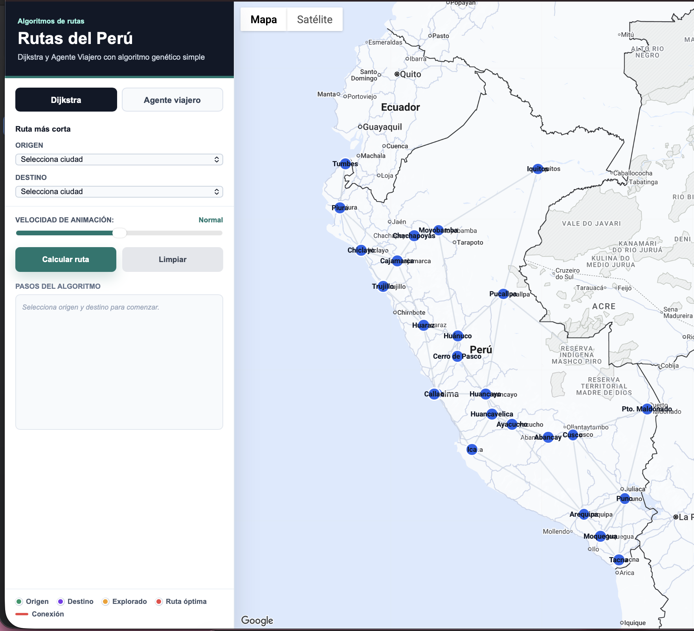
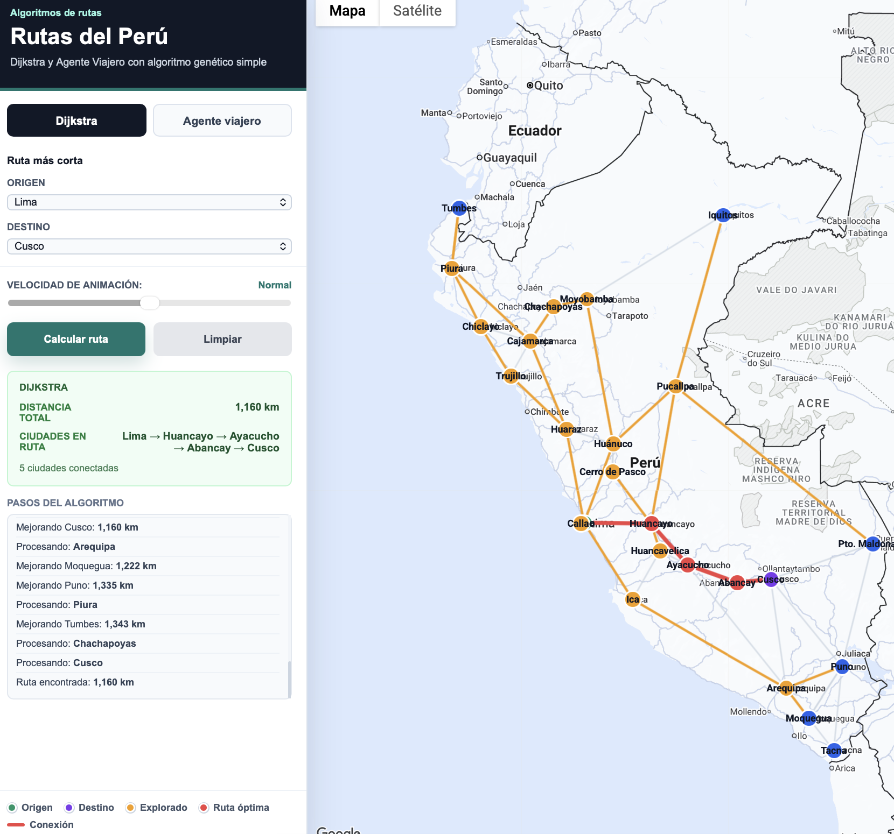
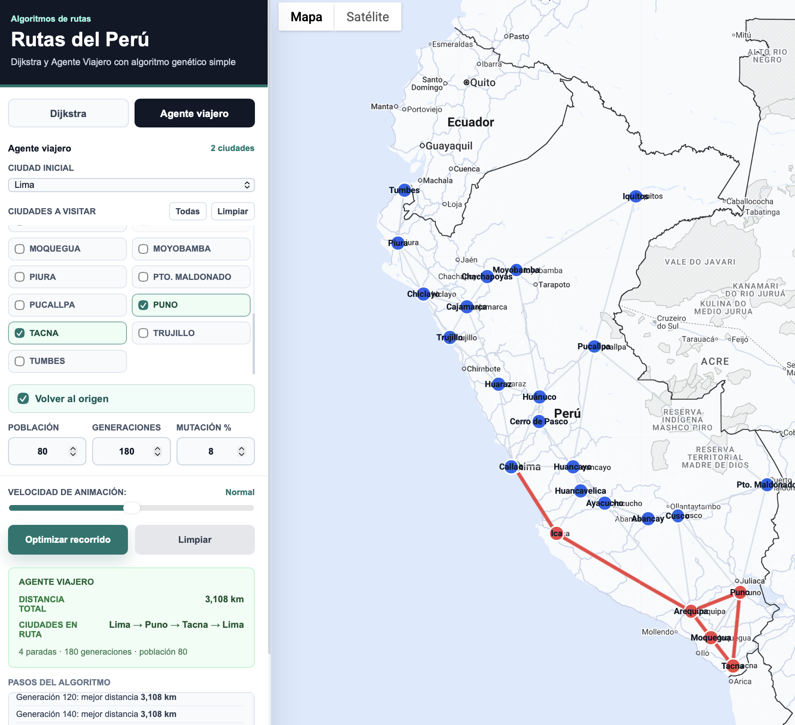
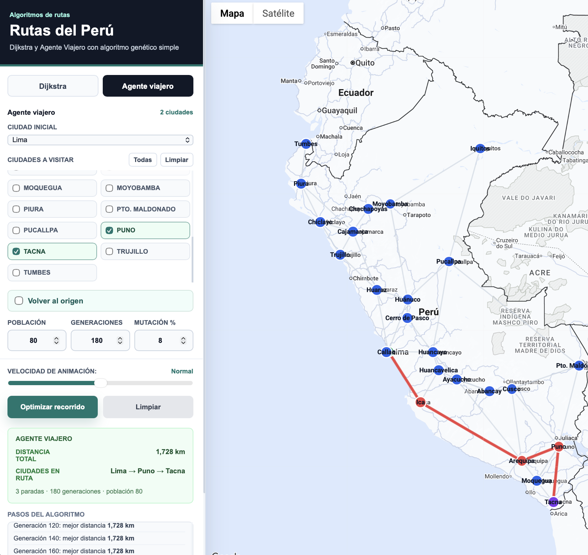

# Rutas del Perú: Dijkstra y Agente Viajero

Aplicación web interactiva para visualizar rutas entre ciudades del Perú usando Google Maps. El proyecto implementa dos modos de cálculo:

- **Dijkstra:** encuentra la ruta más corta entre una ciudad origen y una ciudad destino.
- **Agente Viajero:** optimiza el orden de visita de varias ciudades usando un **algoritmo genético simple**.

## Capturas

### Vista general



### Ruta más corta con Dijkstra



### Agente Viajero con retorno al origen



### Agente Viajero sin retorno al origen



## Funcionalidades

- Visualización de ciudades del Perú sobre Google Maps.
- Representación del mapa como grafo ponderado.
- Cálculo de ruta mínima entre dos ciudades con Dijkstra.
- Selección de múltiples ciudades para el problema del Agente Viajero.
- Optimización de recorrido mediante algoritmo genético.
- Opción para volver o no volver a la ciudad inicial.
- Controles de población, generaciones y porcentaje de mutación.
- Animación visual del proceso y panel de resultados.

## Cómo funciona

El proyecto usa un grafo donde cada ciudad es un nodo y cada conexión entre ciudades es una arista con distancia en kilómetros.

En el modo **Dijkstra**, el sistema calcula directamente el camino más corto entre dos ciudades.

En el modo **Agente Viajero**, el sistema:

1. Toma una ciudad inicial y varias ciudades a visitar.
2. Calcula con Dijkstra la distancia mínima entre cada par de ciudades seleccionadas.
3. Construye una matriz de distancias.
4. Ejecuta un algoritmo genético para encontrar un buen orden de visita.
5. Dibuja el recorrido final en el mapa.

## Algoritmo genético

Cada individuo representa un posible orden de visita. Por ejemplo:

```txt
Lima → Ica → Arequipa → Puno → Cusco → Lima
```

El algoritmo trabaja con:

- **Población inicial:** conjunto de rutas candidatas.
- **Evaluación:** calcula los kilómetros totales de cada ruta.
- **Selección:** elige mejores rutas mediante torneo.
- **Cruce:** combina rutas usando cruce por orden.
- **Mutación:** intercambia dos ciudades al azar.
- **Elitismo:** conserva las mejores rutas de cada generación.

El objetivo es minimizar la distancia total recorrida.

## Resultados esperados

Ejemplo de Dijkstra:

```txt
Origen: Lima
Destino: Cusco
Ruta: Lima → Huancayo → Ayacucho → Abancay → Cusco
Distancia: 1,160 km
```

Ejemplo de Agente Viajero con retorno:

```txt
Inicio: Lima
Visitar: Ica, Arequipa, Cusco, Puno
Ruta: Lima → Ica → Arequipa → Puno → Cusco → Lima
Distancia: 2,882 km
```

Ejemplo de Agente Viajero sin retorno:

```txt
Inicio: Lima
Visitar: Ica, Arequipa, Cusco, Puno
Ruta: Lima → Ica → Arequipa → Puno → Cusco
Distancia: 1,722 km
```

La ruta con retorno suma más kilómetros porque agrega el tramo final de regreso al origen.

## Estructura del proyecto

```txt
dijkstra-maps/
├── index.html
├── style.css
├── app.js
├── data.js
├── informe_rutas_tsp_genetico.tex
├── interfazgeneral.png
├── rutadijkstra.png
├── agenteviajeroconretorno.png
└── agenteviajerosinretorno.png
```

## Ejecución local

Antes de ejecutar, abre `index.html` y reemplaza:

```txt
AQUI_TU_API_KEY
```

por tu propia clave de Google Maps JavaScript API.

Desde la carpeta del proyecto:

```bash
python3 -m http.server 5173
```

Luego abrir:

```txt
http://localhost:5173
```

## Tecnologías usadas

- HTML
- CSS
- JavaScript
- Google Maps JavaScript API
- Algoritmo de Dijkstra
- Problema del Agente Viajero
- Algoritmo genético simple

## Nota sobre Google Maps

El mapa depende de una clave de Google Maps JavaScript API. La clave real no se incluye en el repositorio por seguridad. Si usas una clave propia, se recomienda restringirla desde Google Cloud por dominio o referrer.

## Autor

Willian Luis Ñaupa Copacondori
